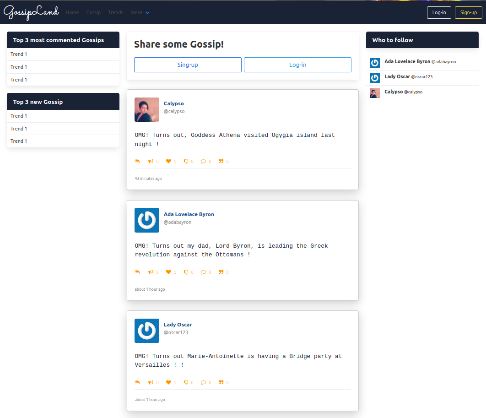
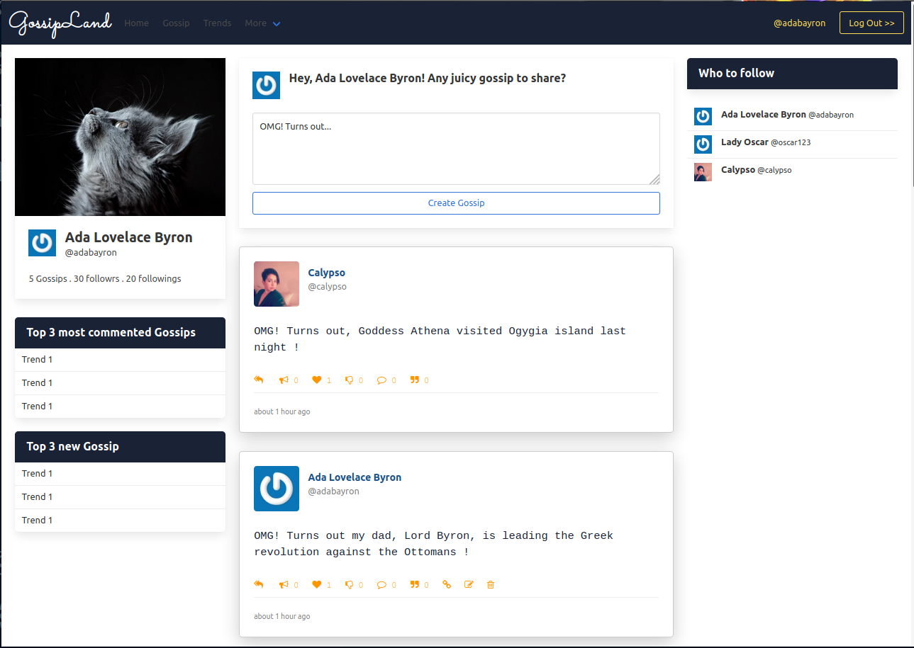
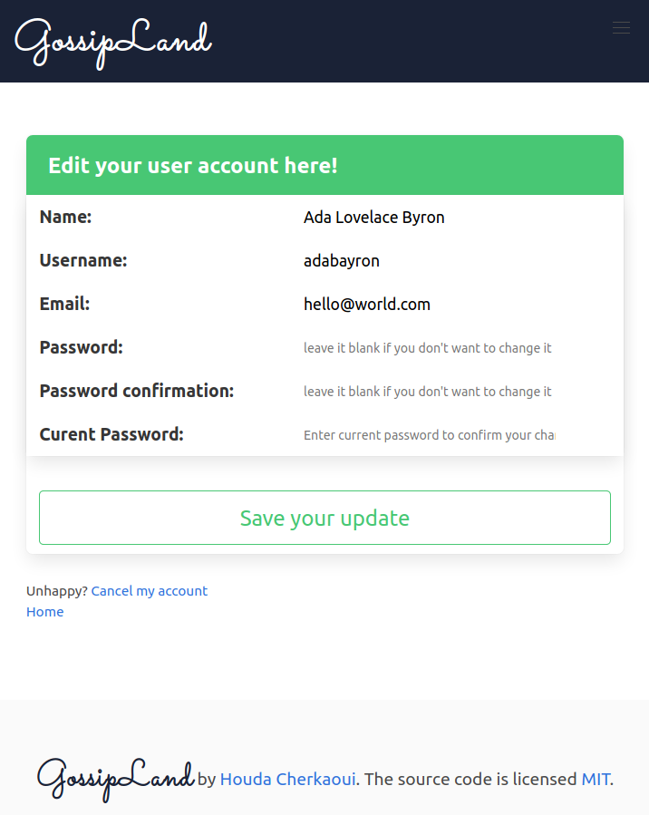
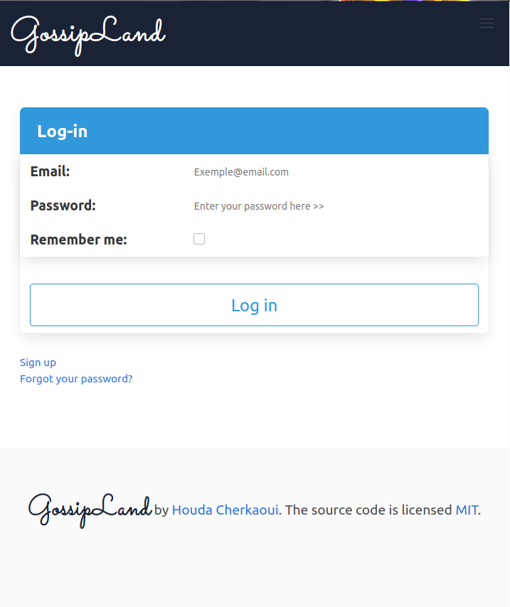
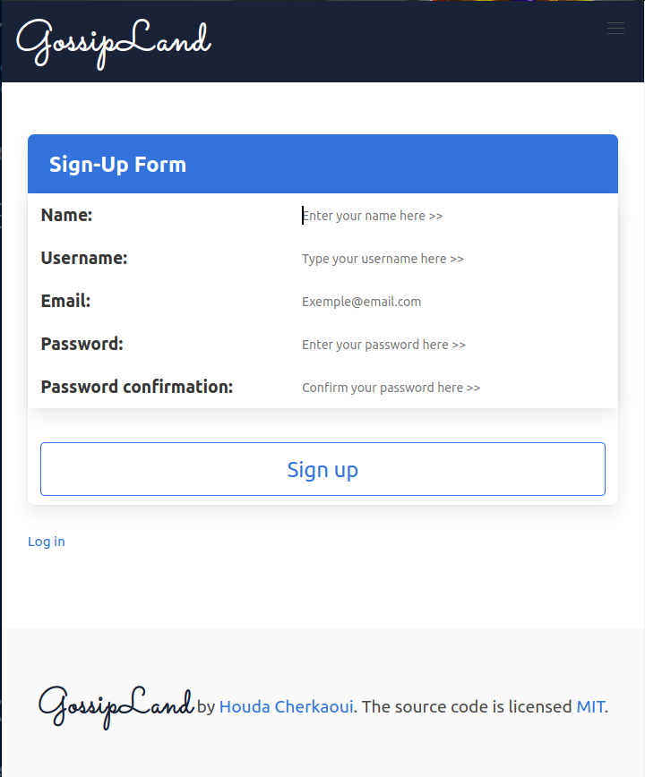
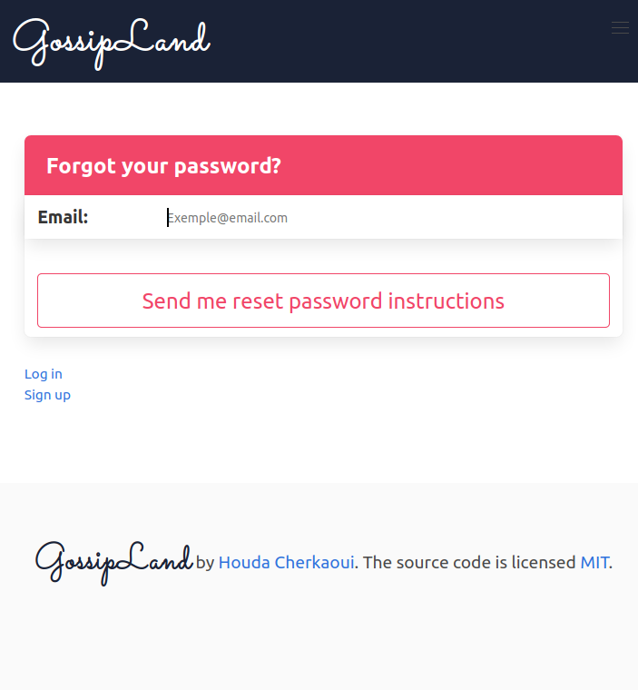

# Building a Blog with Rails

For pure learning purposes, I've tried here to build a Twitter clone using what I've learned so far about Rails:
  - Models
  - MVC concept
  - Sessions, Cookies
  - Authentication

## Demo:

Home page with two scenarios : When user is Loged-in and when not:
<br>

<span> </span>
<br><br>
Some Forms:

<span> </span><span> </span><span> </span>


## Built with:

<a href="#" target="_blank"></a>
<a href="#" target="_blank"></a>
<a href="#" target="_blank"></a>
<a href="#" target="_blank"></a>

- Framework/API : ``Ruby on Rails``, ``Bulma``
- Langage: ``Ruby``
- Text-editor: ``Visual Studio Code``

## Somme useful Gems added:

- Devise
- bulma-rails
- gravatar_image_tag
- simple_form

## Models

The models created and their relationships:
```
Gossip:
  -id: Integer
  -Body:Text
  BELONGS_TO: User
```
```
User:
  -id: Integer
  -Name:String
  -Username:String
  -Password:Secure password with Devise
  -Email:String, Email format
  HAS_MANY: Gossips
```

## Getting started

To get a local copy of the repository please run the following commands on your terminal:

```
$ git clone git@github.com:CalyCherkaoui/my_twitter_clone.git
$ cd my_twitter_clone
$ git checkout development
$ bundle install
$ yarn install --check-files
$ rails db:migrate
$ rails server
```
In your browser's adress field, type : http://localhost:3000

## Author

👤 **Houda Cherkaoui**

- Github: [@CalyCherkaoui](https://github.com/CalyCherkaoui)
- Twitter: [@Houda59579688](https://twitter.com/Houda59579688)
- Linkedin: [Houda-Cherkaoui](https://www.linkedin.com/in/houda-cherkaoui-64106395/)


## 🤝 Contributing

Contributions, issues and feature requests are welcome!

## Show your support

Give a ⭐️ if you like this project!

## Acknowledgments

- Hat tip to anyone whose code was used
- Inspiration
- [ Web-Crunch](https://www.youtube.com/watch?time_continue=1&v=5gUysPm64a4&feature=emb_logo) 

## 📝 License

This project is [MIT]() licensed.